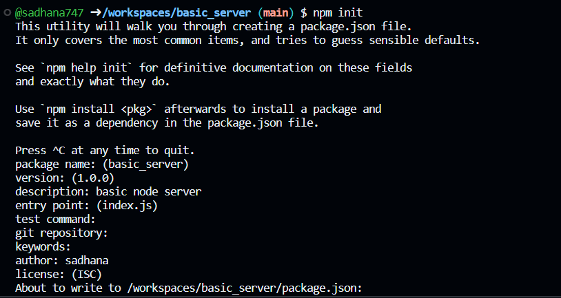
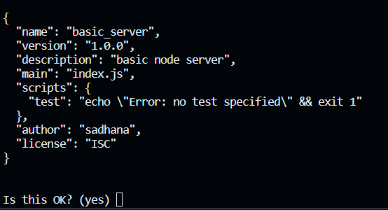

# Basic_Server
## Steps 
### Step - 1
Initialize a new Node.js project

```javascript
npm init
```


This shows the basic details in the `package.json` file. 



write `yes`

A `package.json` file has been created

### Step - 2
Install `Express`
Express serves as the intermediary between requests and responses, facilitating communication between the backend and frontend, and vice versa.

```javascript
$ npm install express --save
```

With `express` node_modules has been created.

Create a script command, to start the script with 
```javascript
"start": "node index.js"
```
It should look something like this now
```javascript
"scripts": {
    "test": "echo \"Error: no test specified\" && exit 1",
    "start": "node index.js"
  },
```

Create a `index.js` file

### Step - 3
The `package.json` file contains a record of all the packages you have installed. For instance, if you have installed the `express` package, it will be listed in this file and categorized as either a normal dependency or a dev dependency.

The `index.js` file is like the main control center of a JavaScript application. It sets things up, manages requests, and handles important tasks like connecting to databases. Its exact job can change depending on the specific application's needs.

Read the documentation for `express` to gain a better understanding of what it can do with requests and responses.
https://expressjs.com/

With the help of below command server has started
```javascript
npm start
```

Because remember? We created `scripts command` with `start` script.

A `Hello World!` will be appeared there!

And here you created, a basic server!